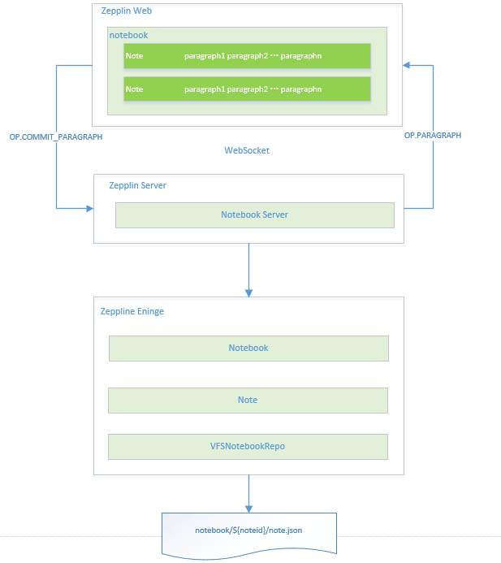
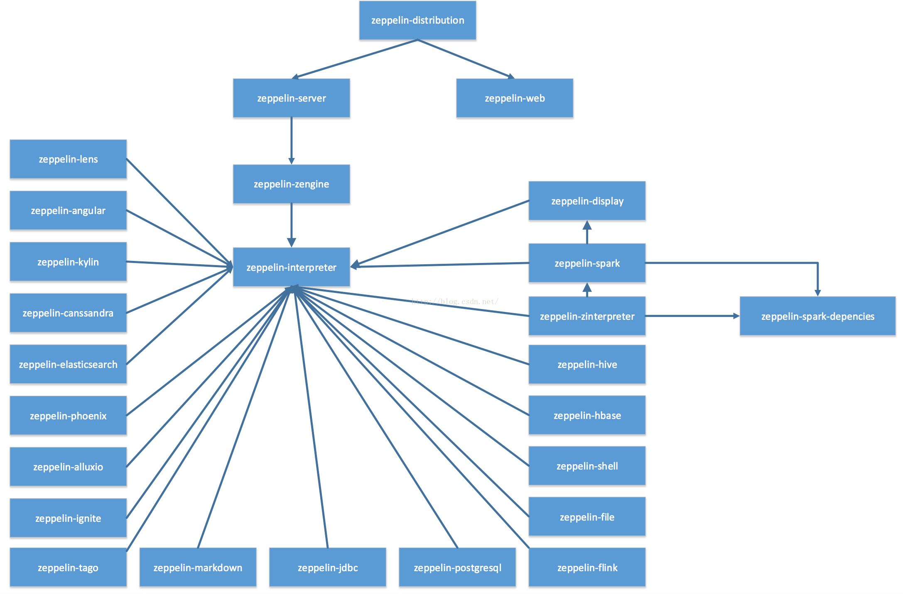

# Apache Zeppelin
```md
是一款基于Web的多用途笔记本，用于数据分析和数据可视化。
```



## Project Hierarchy
* /bin
* /notebook  //默认的notebook的持久化存储目录

## Work Flow

## Modules
* [/conf](modules/Conf.md)

* [zeppelin-server](modules/zeppelin-server/README.md)
```md
项目入口，通过Jetty内嵌服务器提供WebSocekt服务和RESTful服务，并且提供了基本的权限验证服务。
```
* [zeppelin-zengine](modules/zeppelin-zengine/README.md)
```md
实现 Notebook 的持久化和检索服务。
```
* [zeppelin-interpreter](modules/zeppelin-interpreter/README.md)
```md
抽象了 interpreter 接口，规定了解释器的功能。
并且提供了与 zeppelin-zengine 用 Thrift 进行通信的协议。
```
* zeppelin-web
```md
使用 AngluarJS 框架开发的前端。
```
* zeppelin-display
```md
实现前台 Angular 元素绑定后台数据。
```
* zeppelin-spark-dependencies
```md
此module中没有代码，具体作用是使用户可以使用zeppelin内嵌的Spark。
不过由于Zeppelin支持了太多的解释器，package size过大，已经有人提议在未来的版本中移除此模块。
```
* zeppelin-distribution
```md
此模块主要是为了 Zeppelin 打包使用。
编译完成之后，会在zeppelin-distribution/target/目录下生成分发包。
```
* helium-dev
```md
Zeppelin-0.7 以后新加入的模块，使 interpreter、storage 
等模块可以在运行时（Zeppelin不需要重启）加入到 Zeppelin 中。
不过目前 helium 相关的很多功能还处于 Experimental 阶段，因此不太建议在生产环境中使用。
``` 


## 技术栈
### 前端
```md
主要使用AngularJS框架开发，使用Node.js进行包的构建。
使用Jupyter Notebook实现记事本功能，并且使用了Highlight.js和Bootstrap。
```
### 后端
```md
使用了Jetty作为内嵌服务器，通信方式除了WebSocket，还使用Jersey框架提供了Restful服务。

由于Zeppelin的解释器（Interpreter）是独立的JVM进程，
因此Zeppelin 使用 Apache Commons Exec 框架来使主进程可以启动解释器进程，
并且使用Thrift框架在主进程与解释器进程间进行通信。

使用 Apache Shiro进行权限控制，
使用Apache Lucence对Note进行全文检索。
```

## References
* [zeppelin 源码分析](https://blog.csdn.net/spacewalkman/article/category/6228596)