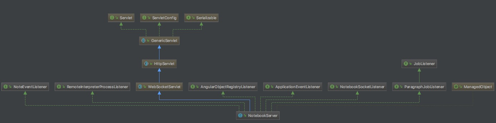

# NotebookServer



```java
 @Override
  public void onMessage(NotebookSocket conn, String msg) {
    try {
      Message messagereceived = deserializeMessage(msg);
      if (messagereceived.op != OP.PING) {
        LOG.debug("RECEIVE: " + messagereceived.op +
            ", RECEIVE PRINCIPAL: " + messagereceived.principal +
            ", RECEIVE TICKET: " + messagereceived.ticket +
            ", RECEIVE ROLES: " + messagereceived.roles +
            ", RECEIVE DATA: " + messagereceived.data);
      }
      if (LOG.isTraceEnabled()) {
        LOG.trace("RECEIVE MSG = " + messagereceived);
      }

      String ticket = TicketContainer.instance.getTicket(messagereceived.principal);
      if (ticket != null &&
          (messagereceived.ticket == null || !ticket.equals(messagereceived.ticket))) {
        /* not to pollute logs, log instead of exception */
        if (StringUtils.isEmpty(messagereceived.ticket)) {
          LOG.debug("{} message: invalid ticket {} != {}", messagereceived.op,
              messagereceived.ticket, ticket);
        } else {
          if (!messagereceived.op.equals(OP.PING)) {
            conn.send(serializeMessage(new Message(OP.SESSION_LOGOUT).put("info",
                "Your ticket is invalid possibly due to server restart. "
                    + "Please login again.")));
          }
        }
        return;
      }

      ZeppelinConfiguration conf = ZeppelinConfiguration.create();
      boolean allowAnonymous = conf.isAnonymousAllowed();
      if (!allowAnonymous && messagereceived.principal.equals("anonymous")) {
        throw new Exception("Anonymous access not allowed ");
      }

      if (Message.isDisabledForRunningNotes(messagereceived.op)) {
        Note note = getNotebook().getNote((String) messagereceived.get("noteId"));
        if (note != null && note.isRunning()) {
          throw new Exception("Note is now running sequentially. Can not be performed: " +
                  messagereceived.op);
        }
      }

      if (StringUtils.isEmpty(conn.getUser())) {
        connectionManager.addUserConnection(messagereceived.principal, conn);
      }

      // Lets be elegant here
      switch (messagereceived.op) {
        case LIST_NOTES:
          listNotesInfo(conn, messagereceived);
          break;
        case RELOAD_NOTES_FROM_REPO:
          broadcastReloadedNoteList(conn, getServiceContext(messagereceived));
          break;
        case GET_HOME_NOTE:
          getHomeNote(conn, messagereceived);
          break;
        case GET_NOTE:
          getNote(conn, messagereceived);
          break;
        case NEW_NOTE:
          createNote(conn, messagereceived);
          break;
        case DEL_NOTE:
          deleteNote(conn, messagereceived);
          break;
        case REMOVE_FOLDER:
          removeFolder(conn, messagereceived);
          break;
        case MOVE_NOTE_TO_TRASH:
          moveNoteToTrash(conn, messagereceived);
          break;
        case MOVE_FOLDER_TO_TRASH:
          moveFolderToTrash(conn, messagereceived);
          break;
        case EMPTY_TRASH:
          emptyTrash(conn, messagereceived);
          break;
        case RESTORE_FOLDER:
          restoreFolder(conn, messagereceived);
          break;
        case RESTORE_NOTE:
          restoreNote(conn, messagereceived);
          break;
        case RESTORE_ALL:
          restoreAll(conn, messagereceived);
          break;
        case CLONE_NOTE:
          cloneNote(conn, messagereceived);
          break;
        case IMPORT_NOTE:
          importNote(conn, messagereceived);
          break;
        case COMMIT_PARAGRAPH:
          updateParagraph(conn, messagereceived);
          break;
        case RUN_PARAGRAPH:
          runParagraph(conn, messagereceived);
          break;
        case PARAGRAPH_EXECUTED_BY_SPELL:
          broadcastSpellExecution(conn, messagereceived);
          break;
        case RUN_ALL_PARAGRAPHS:
          runAllParagraphs(conn, messagereceived);
          break;
        case CANCEL_PARAGRAPH:
          cancelParagraph(conn, messagereceived);
          break;
        case MOVE_PARAGRAPH:
          moveParagraph(conn, messagereceived);
          break;
        case INSERT_PARAGRAPH:
          insertParagraph(conn, messagereceived);
          break;
        case COPY_PARAGRAPH:
          copyParagraph(conn, messagereceived);
          break;
        case PARAGRAPH_REMOVE:
          removeParagraph(conn, messagereceived);
          break;
        case PARAGRAPH_CLEAR_OUTPUT:
          clearParagraphOutput(conn, messagereceived);
          break;
        case PARAGRAPH_CLEAR_ALL_OUTPUT:
          clearAllParagraphOutput(conn, messagereceived);
          break;
        case NOTE_UPDATE:
          updateNote(conn, messagereceived);
          break;
        case NOTE_RENAME:
          renameNote(conn, messagereceived);
          break;
        case FOLDER_RENAME:
          renameFolder(conn, messagereceived);
          break;
        case UPDATE_PERSONALIZED_MODE:
          updatePersonalizedMode(conn, messagereceived);
          break;
        case COMPLETION:
          completion(conn, messagereceived);
          break;
        case PING:
          break; //do nothing
        case ANGULAR_OBJECT_UPDATED:
          angularObjectUpdated(conn, messagereceived);
          break;
        case ANGULAR_OBJECT_CLIENT_BIND:
          angularObjectClientBind(conn, messagereceived);
          break;
        case ANGULAR_OBJECT_CLIENT_UNBIND:
          angularObjectClientUnbind(conn, messagereceived);
          break;
        case LIST_CONFIGURATIONS:
          sendAllConfigurations(conn, messagereceived);
          break;
        case CHECKPOINT_NOTE:
          checkpointNote(conn, messagereceived);
          break;
        case LIST_REVISION_HISTORY:
          listRevisionHistory(conn, messagereceived);
          break;
        case SET_NOTE_REVISION:
          setNoteRevision(conn, messagereceived);
          break;
        case NOTE_REVISION:
          getNoteByRevision(conn, messagereceived);
          break;
        case NOTE_REVISION_FOR_COMPARE:
          getNoteByRevisionForCompare(conn, messagereceived);
          break;
        case LIST_NOTE_JOBS:
          unicastNoteJobInfo(conn, messagereceived);
          break;
        case UNSUBSCRIBE_UPDATE_NOTE_JOBS:
          unsubscribeNoteJobInfo(conn);
          break;
        case GET_INTERPRETER_BINDINGS:
          getInterpreterBindings(conn, messagereceived);
          break;
        case EDITOR_SETTING:
          getEditorSetting(conn, messagereceived);
          break;
        case GET_INTERPRETER_SETTINGS:
          getInterpreterSettings(conn);
          break;
        case WATCHER:
          connectionManager.switchConnectionToWatcher(conn);
          break;
        case SAVE_NOTE_FORMS:
          saveNoteForms(conn, messagereceived);
          break;
        case REMOVE_NOTE_FORMS:
          removeNoteForms(conn, messagereceived);
          break;
        case PATCH_PARAGRAPH:
          patchParagraph(conn, messagereceived);
          break;
        default:
          break;
      }
    } catch (Exception e) {
      LOG.error("Can't handle message: " + msg, e);
      try {
        conn.send(serializeMessage(new Message(OP.ERROR_INFO).put("info", e.getMessage())));
      } catch (IOException iox) {
        LOG.error("Fail to send error info", iox);
      }
    }
  }
```