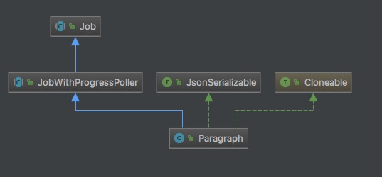

# org.apache.zeppelin.notebook.Paragraph


```md
Paragraph代表着一段代码以及支撑其执行所需要的“环境信息”，是代码执行的最小单位。
```
```md
Paragraph的职责如下： 
1. 获取代码文本，并解析分离类似%spark的interpreter声明段和可执行代码段。 
2. 代码执行，以及执行过程控制（进度和终止） 
3. 代码执行结果获取 
4. 代码中变量查找以及替换
```