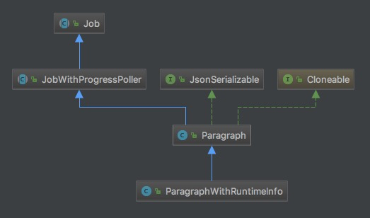

# Paragraph



* Websocket Request
```json
{
"op":"RUN_PARAGRAPH",
"data":{
  "id":"20190227-171144_1849896810",
  "paragraph":"import sqlContext.implicits._\n\nval ip2region = sc.textFile(\"hdfs://10.96.111.130:9000/wordcountdemo/input/ipdata_code_with_maxmind.txt\")\n\ncase class Ip(ipstart:Long, ipend:Long, country:String, province: String, city : String, county: String)\n\nval ip_map = ip2region.map(s=>s.split(\",\")).filter(s=>(s.length==9)).map(\ns=>Ip(s(0).toLong,\ns(1).toLong, s(2), s(3), s(4), s(5))\n).toDF()\n\nip_map.registerTempTable(\"ip2region\")",
  "config":{
    "colWidth":12,
    "fontSize":9,
    "enabled":true,
    "results":{
    },
    "editorSetting":{
      "language":"scala",
      "editOnDblClick":false,
      "completionKey":"TAB",
      "completionSupport":true
    },
    "editorMode":"ace/mode/scala",
    "tableHide":false,
    "editorHide":true
  },
  "params":{
  }
},
"principal":"anonymous",
"ticket":"anonymous",
"roles":"[\"anonymous\"]"
}
```

## Work Flow
* run

## Class Code
```java
  private static String generateId() {
    return "paragraph_" + System.currentTimeMillis() + "_" + new SecureRandom().nextInt();
  }
```

