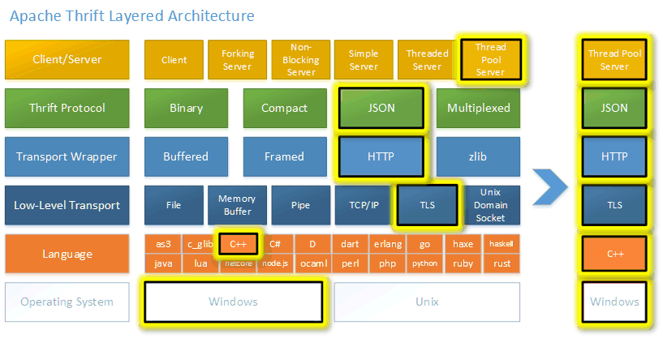

# [Apache Thrift](https://github.com/apache/thrift)

## [What Is Apache Thrift](WhatIs.md)

## Project Hierarchy
* thrift/
* [compiler/](compiler/README.md)
* [lib/   # 包含Thrift软件库实现，细分为实施语言](lib/README.md)
* test/
* tutorial/

## [How Thrift Work](design/README.md)

* [Thrift 类](ClassThrift.md)

## [.thrift](.thrift/README.md)

## [Development](dev/README.md)

## Integration
* Docker Integration

## Resources
* [Java Tutorial](http://thrift.apache.org/tutorial/java)

* [ThriftDemo](https://github.com/yongshun/some_java_code/tree/master/ThriftDemo)
