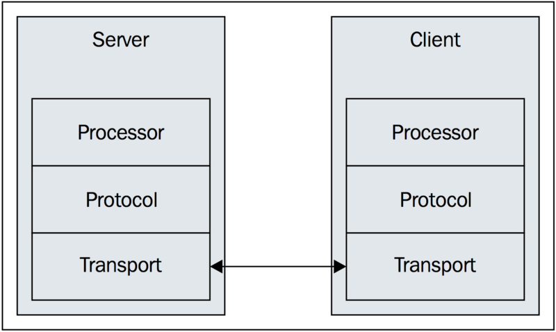

# How Thrift Work


## 网络栈

* [Transport](Layer-Transport.md)
* [Protocol](Layer-Protocol.md)
* [Processor](Layer-Processor.md)

* Server层 （thrift 服务模型）
```md
TNonblockingServer: 
  是一个基于多线程, 非阻塞 IO 的 Server 层实现, 它专门用于处理大量的并发请求。

THsHaServer: 
  半同步/半异步服务器模型, 基于 TNonblockingServer 实现。

TThreadPoolServer:
  基于多线程, 阻塞 IO 的 Server 层实现, 
  它所消耗的系统资源比 TNonblockingServer 高, 不过可以提供更高的吞吐量。

TSimpleServer: 
  它只有一个线程, 并且是阻塞 IO, 因此在同一时间只能处理一个连接，常用于测试。
```
