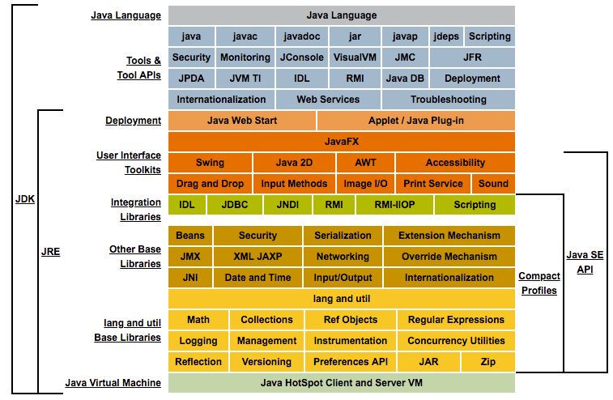

# Java 源码

## [JDK](JDK/README.md)

* [Java Collection](JDK/collection/README.md)

### rt.jar
### java.
* [java.lang](JDK/java.lang/README.md)
* [java.util](JDK/java.util/README.md)
> * [java.concurrent.util](JDK/java.util.concurrent/README.md)
* [java.io](JDK/java.io/README.md)
* [java.nio]()
* [java.net](JDK/java.net/README.md)
* java.math
* [java.security](JDK/java.security/README.md)
* java.sql
* java.time
* java.beans
* java.rmi
* java.text
* java.applet
* java.awt

### javax.
* javax.xml

### com.

### org.

### sun.
* sun.reflect

### apple.

##
* [Google guava](Guava/README.md)

* Junit

* Okhttp