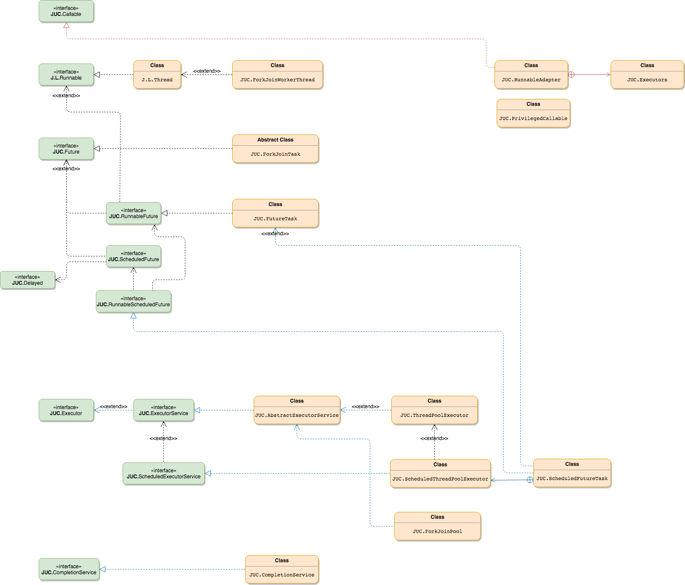

# Java Concurrency

## Thread Sync
* [ReentrantLock](sync/ReentrantLock.md)
* [Condition](sync/Condition.md)
* [java.util.concurrent.Semaphore ](sync/Semaphore.md)
* [ReadWriteLock](sync/ReadWriteLock.md)
* [CountDownLatch](sync/CountDownLatch.md)
* [CyclicBarrier](sync/CyclicBarrier.md)
* [LockSupport](sync/LockSupport.md)

## Thread Safe
* [ThreadLocal](safe/ThreadLocal.md)

## Class Graph
### JUC Thread Class Graph

### JUC Lock Class Graph
