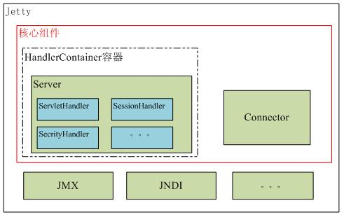
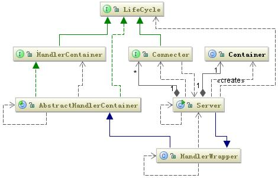
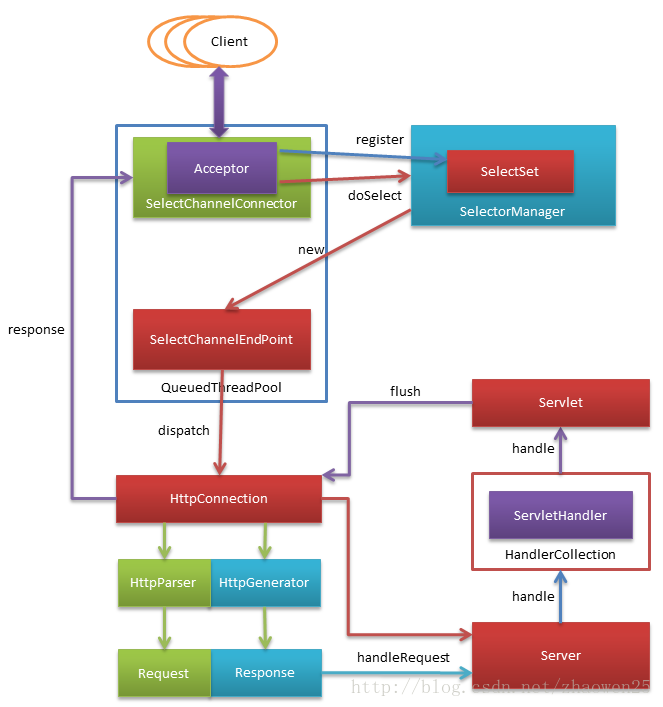
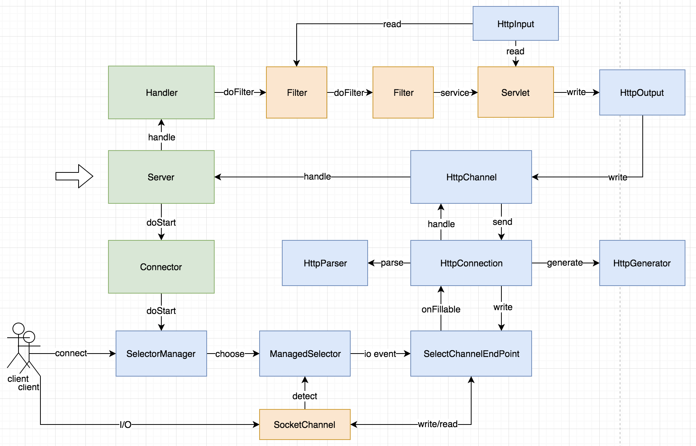

# [Jetty -  Servlet Engine and Http Server](https://www.eclipse.org/jetty/) 
> [github](https://github.com/eclipse/jetty.project)

## [WhatIs](WhatIs.md)

## Jetty Architecture

```md
Connector 负责接收网络请求，
Handler 负责解析请求并产生响应，
通过线程池 ThreadPool 来执行任务，

而Connector，Handler，ThreadPool 这三个组件都是依附在Server中。
```

```md
Jetty 的核心是围绕着 Server 类来构建，Server 类继承了 Handler，关联了 Connector 和 Container。
Container 是管理 Mbean 的容器。
Jetty 的 Server 的扩展主要是实现一个个 Handler 并将 Handler 加到 Server 中，Server 中提供了调用这些 Handler 的访问规则。
```
```md
Jetty 中还有一些可有可无的组件，我们可以在它上做扩展。
如 JMX，你可以定义一些 Mbean 把它加到 Server 中，当 Server 启动的时候，这些 Bean 就会一起工作。
```
* [Connector](jetty/Connector.md)
* [Handler](jetty/Handler.md)
* Server

* [ThreadPool](jetty/ThreadPool.md)

* [LifeCycle](jetty/LifeCycle.md)

## [Jetty Workflow](jetty-workflow/README.md)


```md
核心类：org.mortbay.jetty.Server
核心接口：org.mortbay.component.LifeCycle
核心线程池封装：org.mortbay.thread.QueuedThreadPool
核心IO处理类：org.mortbay.jetty.nio.SelectChannelConnector
核心Servlet处理类：org.mortbay.jetty.servlet.ServletHandler
```

```md
绿色部分是Jetty开放给开发者使用的；
浅橙色表示JDK或Servlet规范定义的（或开发者实现的），不属于Jetty自身实现；
蓝色部分表示Jetty内部实现的一些组件，不对外暴露
```
### Work Mode
```md
Jetty 作为一个独立的 Servlet 引擎可以独立提供 Web 服务，也可以与其他 Web 应用服务器集成。
提供基于两种协议工作 一个是 HTTP，一个是 AJP 协议。
```
* [基于 HTTP 协议工作](jetty-workflow/jetty/WorkMode-HTTP.md)
* [基于 AJP 工作](jetty-workflow/jetty/WorkMode-AJP.md)

## Jetty Code Modules
* [jetty-servlet](jetty-servlet/README.md)
* [jetty-webapp](jetty-webapp/README.md)
* [jetty-websocket](jetty-websocket/README.md)
* [jetty-http](jetty-http/README.md)
* [jetty-server](jetty-server/README.md)
* jetty-client
* jetty-fcgi
* jetty-http2
* jetty-io
* jetty-jmx
* jetty-memcached
* jetty-security
* jetty-annotations
* jetty-jaas

## Integrate
* 与 Jboss 集成
```md
前面介绍了 Jetty 可以基于 AJP 协议工作，在正常的企业级应用中，Jetty 作为一个 Servlet 引擎都是基于 AJP 协议工作的，
所以它前面必然有一个服务器，通常情况下与 Jboss 集成的可能性非常大。
```

## [API](https://www.eclipse.org/jetty/javadoc/current/index.html)

## Utility
* JFinal

## Reference
* [Jetty9源码剖析](https://www.ph0ly.com/)
* [The Definitive Reference](https://www.eclipse.org/jetty/documentation/9.4.x/)
* [芋道源码 - Jetty 源码解析](http://www.iocoder.cn/Jetty/Jetty-collection/?vip)

* [Jetty使用教程](http://www.cnblogs.com/yiwangzhibujian/p/5845623.html)
