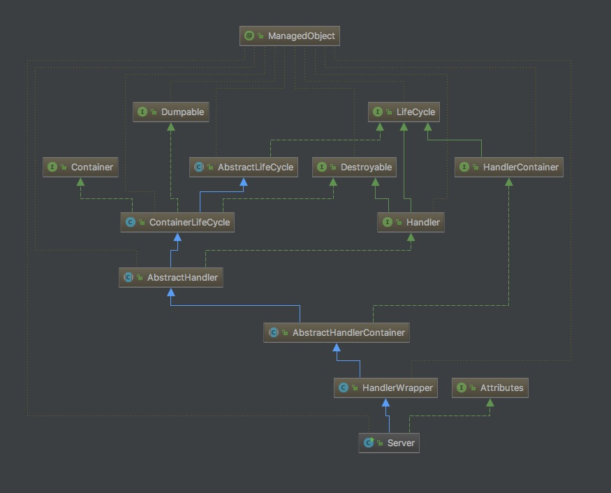
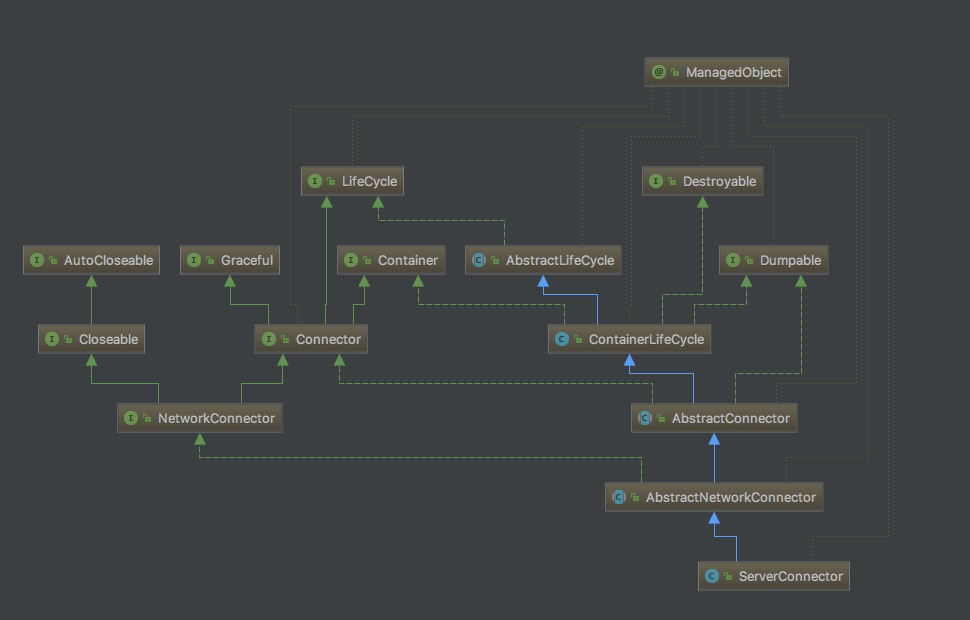

# jetty.server.Server

```md
核心类
	org.mortbay.jetty.Server
	介绍
		整个 Jetty 的核心是围绕着 Server 类来构建
		Server 类继承了 Handler，关联了 Connector 和 Container
		Jetty 的 Server 的扩展主要是实现一个个 Handler 并将 Handler 加到 Server 中，Server 中提供了调用这些 Handler 的访问规则
```




* ServerConnector (HTTP connector using NIO ByteChannels and Selectors)



## 
* start
```md
AbstractLifeCycle start() -> doStart(); 预留了doStart()方法供子类重写。
|-ContainerLifeCycle doStart()
  |-AbstractConnector 
    |-AbstractNetworkConnector doStart() ->open(); 设置了一个open方法供子类重写
      |-ServerConnector	open()； 实现了open方法，打开ServerSocketChannel
```
