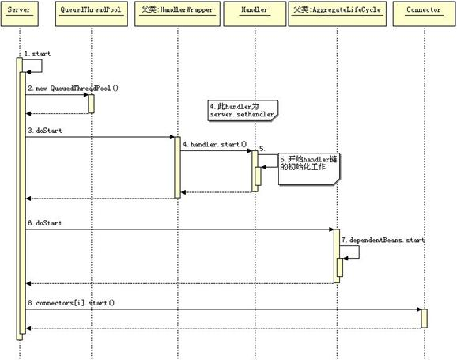

# Workflow
### 启动
```md
首先创建一个Server，然后创建ServerConnector作为通信层，并关联到Server，
再创建ServletContextHandler作为Handler来处理业务，可以看到这里加了2个Servlet，
然后把这2个Servlet放到一个集合传给Server，最后调用Server.start启动服务器
```
```md
所有的组件最终都被关联到了Server，其实Server就是一个大容器，
将容器内的所有具有生命周期的组件全部逐层启动（start），
另一些不具有生命周期的组件仍然可以把Server看成一个IOC容器，后续可以直接获取到实例对象
```
```md
Server触发Connector、Handler组件启动，而Connector又会触发SelectorManager、ManagedSelector启动，
这样其实是逐级启动，Server是一个大容器，而Handler也可能是一个大容器（例如WebAppContext，感兴趣的读者可以跳到后续文章），
这个启动过程其实是LifeCycle组件定义的
```

```md
Jetty 的入口是 Server 类，Server 类启动完成了，就代表 Jetty 能为你提供服务了
它到底能提供哪些服务，就要看 Server 类启动时都调用了其它组件的 start 方法
从 Jetty 的配置文件我们可以发现，配置 Jetty 的过程就是将那些类配置到 Server 的过程
Jetty 中所有的组件都会继承 LifeCycle
	所以 Server 的 start 方法调用就会调用所有已经注册到 Server 的组件
```
```md
启动设置到 Server 的 Handler，通常这个 Handler 会有很多子 Handler，这些 Handler 将组成一个 Handler 链
	Server 会依次启动这个链上的所有 Handler
```
```md
接着会启动注册在 Server 上 JMX 的 Mbean，让 Mbean 也一起工作起来，
最后会启动 Connector，打开端口，接受客户端请求，启动逻辑非常简单。
```
### 连接
```md
当client与Jetty服务器建立连接时，连接会直接打到SelectorManager提供的ServerSocketChannel，
accept后，拿到这个client对应的SocketChannel后，会选择一个ManagedSelector来执行IO事件检测，
并创建好这条连接对应的EndPoint以及Connection
```

### 请求
```md
当client向刚才建立的连接中写入请求数据时，ManagedSelector对应的事件检测循环会探测到读事件，
会触发SelectChannelEndPoint触发读回调，从而调用到HttpConnection.onFillable，onFillable里面
借助于ByteBufferPool、HttpParser完成数据读取及解析，将解析后的元数据放入Request，
直接触发HttpChannel.handle，这会打到Server.handle方法，Server会找到之前关联到自身的Handler，
执行这个Handler的handle方法，这样就开启了Handler执行链，层层调用，最后调用到应用层Filter、Servlet，完成业务操作。
```

### 响应 
```md
当应用层完成业务操作后，调用Response.getWriter或Response.getOutputStream，
最终会调用到HttpOutput.write方法，触发数据回写，这时调用到HttpChannel.write，
这里会触发HttpConnection.send，而HttpConnection会利用HttpGenerator生成响应报文，
然后触发SelectChannelEndPoint向SocketChannel刷数据，这样就完成了响应。
```