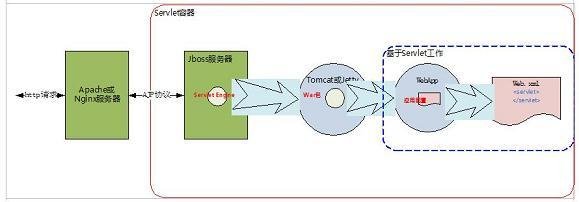

# Jetty On AJP
```md
如果将 Jetty 集成到 Jboss 或者 Apache，那么就可以让 Jetty 基于 AJP 模式工作
```
```md
servlet 引擎就不需要解析和封装返回的 HTTP 协议
	因为 HTTP 协议的解析工作已经在 Apache 或 Nginx 服务器上完成了
	boss 只要基于更加简单的 AJP 协议工作就行了，这样能加快请求的响应速度
```
```md
AJP（Apache JServ Protocol）是定向包协议。
因为性能原因，使用二进制格式来传输可读性文本。
WEB服务器通过TCP连接和SERVLET容器连接。
```
```md
通常一个 web 服务站点的后端服务器不是将 Java 的应用服务器直接暴露给服务访问者，
而是在应用服务器，如 Jboss 的前面在加一个 web 服务器，如 Apache 或者 nginx，
我想这个原因大家应该很容易理解，如做日志分析、负载均衡、权限控制、防止恶意请求以及静态资源预加载等等。
```

```md
上图的架构下 servlet 引擎就不需要解析和封装返回的 HTTP 协议，
因为 HTTP 协议的解析工作已经在 Apache 或 Nginx 服务器上完成了，
Jboss 只要基于更加简单的 AJP 协议工作就行了，这样能加快请求的响应速度。
```
```md
对比 HTTP 协议的时序图可以发现，它们的逻辑几乎是相同的，
不同的是替换了一个类 Ajp13Parserer 而不是 HttpParser，它定义了如何处理 AJP 协议以及需要哪些类来配合。
```
```md
实际上在 AJP 处理请求相比较 HTTP 时唯一的不同就是在读取到 socket 数据包时，
如何来转换这个数据包，是按照 HTTP 协议的包格式来解析就是 HttpParser，
按照 AJP 协议来解析就是 Ajp13Parserer。封装返回的数据也是如此。
```
```md
让 Jetty 工作在 AJP 协议下，需要配置 connector 的实现类为 Ajp13SocketConnector，
这个类继承了 SocketConnector 类，覆盖了父类的 newConnection 方法，
为的是创建 Ajp13Connection 对象而不是 HttpConnection。
```
