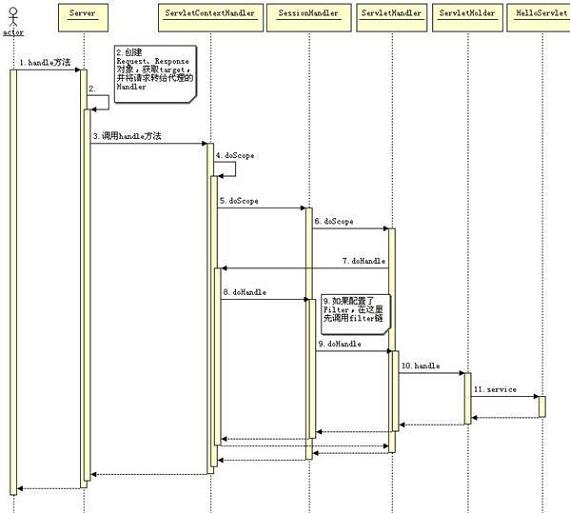

# Jetty On Http
```md
如果前端没有其它 web 服务器，那么 Jetty 应该是基于 HTTP 协议工作。
也就是当 Jetty 接收到一个请求时，必须要按照 HTTP 协议解析请求和封装返回的数据。
```
```md
我们设置 Jetty 的 Connector 实现类为 org.eclipse.jetty.server.bi.SocketConnector 让 Jetty 以 BIO 的方式工作，
Jetty 在启动时将会创建 BIO 的工作环境，它会创建 HttpConnection 类用来解析和封装 HTTP1.1 的协议，
ConnectorEndPoint 类是以 BIO 的处理方式处理连接请求，ServerSocket 是建立 socket 连接接受和传送数据，
Executor 是处理连接的线程池，它负责处理每一个请求队列中任务。acceptorThread 是监听连接请求，一有 socket 连接，它将进入下面的处理流程。
```
```md
当 socket 被真正执行时，HttpConnection 将被调用，
这里定义了如何将请求传递到 servlet 容器里，有如何将请求最终路由到目的 servlet，
关于这个细节可以参考《 servlet 工作原理解析》一文。
```
## Jetty 创建接受连接环境需要三个步骤：
```md
创建一个队列线程池，用于处理每个建立连接产生的任务，这个线程池可以由用户来指定，这个和 Tomcat 是类似的。
创建 ServerSocket，用于准备接受客户端的 socket 请求，以及客户端用来包装这个 socket 的一些辅助类。
创建一个或多个监听线程，用来监听访问端口是否有连接进来。
```

```md
当建立连接的环境已经准备好了，就可以接受 HTTP 请求了，当 Acceptor 接受到 socket 连接后将转入以下流程执行：
Accetptor 线程将会为这个请求创建 ConnectorEndPoint。
HttpConnection 用来表示这个连接是一个 HTTP 协议的连接，它会创建 HttpParse 类解析 HTTP 协议，
并且会创建符合 HTTP 协议的 Request 和 Response 对象。
接下去就是将这个线程交给队列线程池去执行了。
```
## BIO工作方式
```md
	我们设置 Jetty 的 Connector 实现类为 org.eclipse.jetty.server.bi.SocketConnector 让 Jetty 以 BIO 的方式工作
		Jetty 在启动时将会创建 BIO 的工作环境，它会创建 HttpConnection 类用来解析和封装 HTTP1.1 的协议
	ConnectorEndPoint 类是以 BIO 的处理方式处理连接请求
	ServerSocket 是建立 socket 连接接受和传送数据
	Executor 是处理连接的线程池，它负责处理每一个请求队列中任务
	acceptorThread 是监听连接请求，一有 socket 连接，它将进入下面的处理流程。
	当 socket 被真正执行时，HttpConnection 将被调用
		这里定义了如何将请求传递到 servlet 容器里，如何将请求最终路由到目的 servlet
```
## 基于 NIO 方式工作
```md
Jetty 也支持 NIO 的处理方式，其中 Jetty 的默认 connector 就是 NIO 方式。

Jetty 的默认 connector 就是 NIO 方式。
	Jetty 的 NIO 处理方式和 Tomcat 的几乎一样，唯一不同的地方是在如何把监听到事件分配给对应的连接的处理方式。
```

## 创建连接

```md
创建一个队列线程池，用于处理每个建立连接产生的任务，这个线程池可以由用户来指定，这个和 Tomcat 是类似的。
创建 ServerSocket，用于准备接受客户端的 socket 请求，以及客户端用来包装这个 socket 的一些辅助类
创建一个或多个监听线程，用来监听访问端口是否有连接进来。
```
## 接受 HTTP 请求

```md
Accetptor 线程将会为这个请求创建 ConnectorEndPoint
HttpConnection 用来表示这个连接是一个 HTTP 协议的连接，它会创建 HttpParse 类解析 HTTP 协议，并且会创建符合 HTTP 协议的 Request 和 Response 对象
接下去就是将这个线程交给队列线程池去执行了。
```

## 处理请求

```md
当 Jetty 接受到一个请求时，Jetty 就把这个请求交给在 Server 中注册的代理 Handler 去执行
如何执行你注册的 Handler，同样由你去规定
	Jetty 要做的就是调用你注册的第一个 Handler 的 handle
	String target, Request baseRequest, HttpServletRequest request, HttpServletResponse response
要能接受一个 web 请求访问，首先要创建一个 ContextHandler，如下代码所示：
	 Server server = new Server(8080); 
	 ContextHandler context = new ContextHandler(); 
	 context.setContextPath("/"); 
	 context.setResourceBase("."); 
	 context.setClassLoader(Thread.currentThread().getContextClassLoader()); 
	 server.setHandler(context); 
	 context.setHandler(new HelloHandler()); 
	 server.start(); 
	 server.join();
当我们在浏览器里敲入 http://localhost:8080 时
	请求将会代理到 Server 类的 handle 方法
	Server 的 handle 的方法将请求代理给 ContextHandler 的 handle 方法
	ContextHandler 又调用 HelloHandler 的 handle 方法
在 Servlet 的 API 中我通常也只实现它的一个包装好的类
	在 Jetty 中也是如此，虽然 ContextHandler 也只是一个 Handler
		但是这个 Handler 通常是由 Jetty 帮你实现了
	我们一般只要实现一些我们具体要做的业务逻辑有关的 Handler 就好了
	而一些流程性的或某些规范的 Handler，我们直接用就好了
关于 Jetty 支持 Servlet 的规范的 Handler 就有多种实现
	访问一个 Servlet 的代码
		Server server = new Server(); 
		 Connector connector = new SelectChannelConnector(); 
		 connector.setPort(8080); 
		 server.setConnectors(new Connector[]{ connector }); 
		 ServletContextHandler root = new 
		 ServletContextHandler(null,"/",ServletContextHandler.SESSIONS); 
		 server.setHandler(root); 
		 root.addServlet(new ServletHolder(new 
		 org.eclipse.jetty.embedded.HelloServlet("Hello")),"/"); 
		 server.start(); 
		 server.join();
	创建一个 ServletContextHandler 并给这个 Handler 添加一个 Servlet
	这里的 ServletHolder 是 Servlet 的一个装饰类
		它十分类似于 Tomcat 中的 StandardWrapper。
```